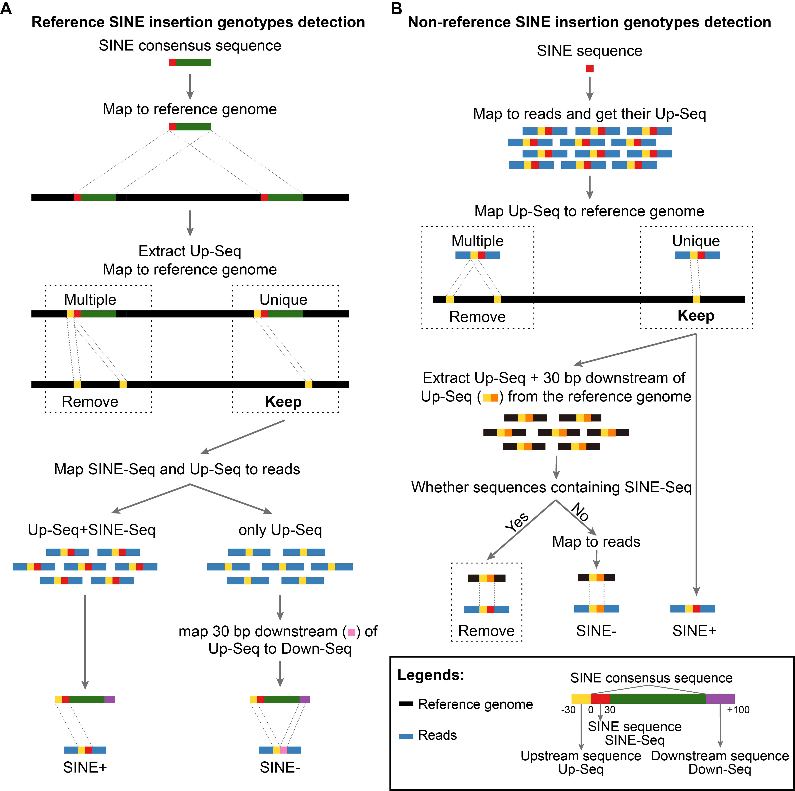

# TypeSINE

TypeSINE is designed to detect short interspersed nuclear element (SINE) retrotransposon insertion polymorphisms directly from raw next-generation sequencing (NGS) data. The analytical workflow comprises two complementary pipelines：

- **Pipeline A** identifies putative polymorphic *SINE* insertions that are present in the reference genome but may be absent in the test genomes.
- **Pipeline B** detects novel polymorphic *SINE* insertions found in the test genomes but missing from the reference genome.

### 
